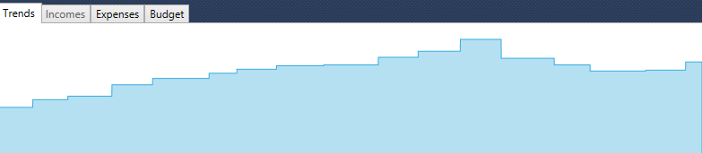

# Assets

You can add an account to track the value of your assets by selecting "Asset" in the account type drop down:

You can then use the Opening Balance of the Account to record the initial value of the Asset, and you can use transactions to add or remove from the value of the asset. 

For example, if you own a house you could add an account for it and each year you could add a transaction that records the new official property value reported by your local government.  For example, you might get a notice like this:

In which case you see an increase from 607k to 651k, an increase of 44k, so you can add a transaction showing a credit like this:

Then over time you will see the trends if you right click and select "Show All":

Same can be done with cars or jewelry or any other large asset you wish to track as part of your net worth statement.

