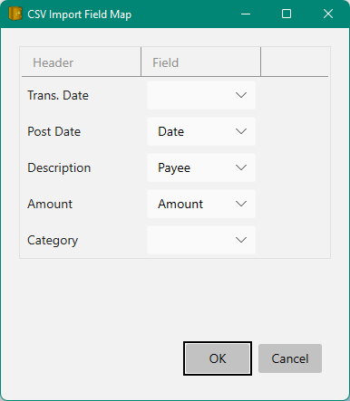

# CSV Importing

Some banks do not support OFX or QIF interchange formats (which really sucks), for example
Discover card only provides a .csv download.

To import CSV (comma separated value) data into Money you can right click the account
in the Accounts View and select `Import Csv...`.  This will prompt for a local file containing
the CSV data (usually these files contain a .csv file extension).

Here's an example of what that .csv data might look like if you load it into Notepad:

```
Trans. Date,Post Date,Description,Amount,Category
10/25/2022,10/26/2022,"AMAZON.COM AMZN.COM/BILLWA1VK3XV7LNTQ",-9.04,"Payments and Credits"
10/24/2022,10/24/2022,"PRIME VIDEO *H86AC1J92 888-802-3080 WA36ZXXX7TXB9",2.51,"Merchandise"
10/23/2022,10/23/2022,"APPLE.COM/BILL 866-712-7753 CAMML0Z2HTZ5A0",5.42,"Merchandise"
10/23/2022,10/23/2022,"HLU*HULU 375513011660-U HULU.COM/BILLCAHLU*HULU 375513011660-U",16.56,"Services"
10/21/2022,10/21/2022,"PAYMENT - THANK YOU",-1607.22,"Payments and Credits"
10/21/2022,10/21/2022,"THE HOME DEPOT #4712 BOTHELL WA",13.21,"Home Improvement"
10/02/2022,10/02/2022,"STARBUCKS 800-782-7282 SEATTLE WA",50.00,"Restaurants"
```

When you select this file a dialog will appear where you can specify how to map the columns
found in this file with the fields of the Money Transactions as follows:



You should check negate CheckBox if your Credit Card Company returns withdrawals as positive numbers and deposits as negative numbers.

This map will be saved in the same folder as your Money database under a new folder named `CsvMaps`
so you will not have to keep re-entering this mapping information (unless the columns are changed by your bank).


See also: [Merging](../Basics/Merging.md) | [Online Banking](OnlineBanking.md)