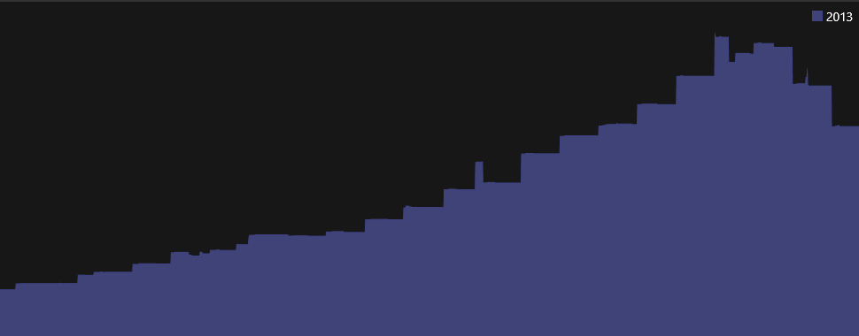

# Investment Accounts

When you create an account of type "**Brokerage**" the Transactions View changes to show some additional columns.  You will also see two tabs at the top, the first is the "activity" transactions, that you can edit.  The second provides a [Portfolio Report](../Reports/InvestmentPortfolio.md).

The transaction columns are augmented with the ability to record Buy/Sell/Add/Remove activity with Securities (Stocks, Mutual Funds, etc). The following shows a Sell, a Buy and a deposit from "Dividends" :

The quantity of shares bought or sold is the exact number of shares on that date.  Do **NOT**  adjust the numbers based on future stock splits.  That is taken care of automatically via the [Securities](../Basics/Securities.md) view. 

The "**Activity** "  column provides the following dropdown:

### Add
Is when stocks are transferred into an account.

### Remove
Stocks are transferred out of an account.

### Buy
A buy transaction

### Sell
A sell transaction

### Dividend
Dividends are deposited.

### None
Everything else, from interested, to long and short term capital gains distributions, etc.  These will be identified by the Category field.

**Note** : this app does not yet support more complex types of investment activity with options.

### ViewBySecurity
You can view all the transactions associated with a single security by right clicking on a row and selecting "View Transactions By Security" or pressing F5.  This will produce a different view showing all activity with a single security, and a balance equal to the market value of your holdings, using unit price information, and taking stock splits into account.

This view has some additional columns:

The security may be held in multiple Accounts.  The FIFO column shows buy/sell activity (assuming FIFO rule). Then the remaining columns have the following meaning:
* **Units** : actual units involved in      the transaction only applicable to buy, sell, add or remove transactions.
* **Units A.S** .: units after any stock      splits
* **Holding** : running tally on total      units held (after stock splits)
* **Unit Price** : the price of this stock as      transacted, or the closing price for the day.
* **Price A.S** .: the effective price after      stock splits
* **Payment** : the cash paid for buy      transactions, or any other debit (like broker fees).
* **Deposit** : the cash deposited for sell      transactions and dividends
* **Balance** : the running balance of the      market value of stock held in this account.

### Historical Market Value

If you have configured your [Stock Quote Service](StockQuoteServices.md) and stock history information is available then the [TrendGraph](../Charts/TrendGraph.md) will show a nice smooth historical account value.
The following shows what the TrendGraph will show if you do **not** have daily stock quote history:

Notice the step functions where market values are only updated when
individual transactions record new unit prices.
The following shows the smooth historical market value that you get
if you have daily stock quote histories already downloaded by the
[Stock Quote Service](StockQuoteServices.md):

### Portfolio Tab
Once the security information with stock splits is setup using the [Securities](../Basics/Securities.md) view and current prices are available (either downloaded automatically using [Stock Quote Services](StockQuoteServices.md), or entered by hand in the Securities view), you can use the second tab of your Investment account called "Portfolio".  This tab provides a report just for this account listing the holdings in that account (ignoring similar holdings in other accounts).  See [Investment Portfolio](../Reports/InvestmentPortfolio.md) for details on what is in this report.

