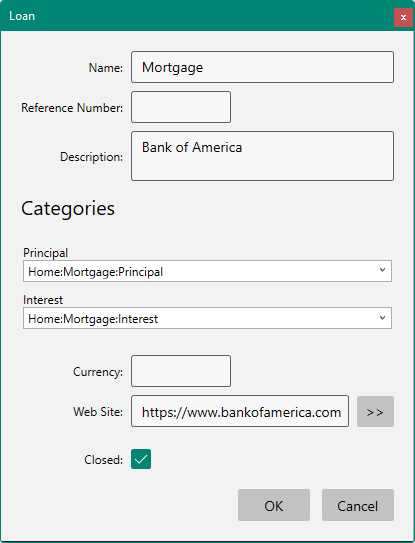

# Loan Accounts

You can track the amount you owe in a loan using a Loan account.  Loan accounts have a different property dialog that looks like this:

Loan accounts automatically find loan payments by matching the specified Principal an Interest categories from other accounts then list the transactions grouped by year showing how much is remaining on the loan.  It also computes the interest rate on the loan based on the interest amounts that you are paying:

To enter the initial amount you have loaned from the bank, add a new transaction at the bottom of the register and type in the amount there and the initial loan date.  The transaction will then jump to the top of the list so that the Balance column will be correct.

If you select a row and press F12 it will take you to the payment you made in your checking account:

Notice this payment is "Split" and the two special categories that the Loan is looking for are provided in the Split.

If your loan is refinanced you can simply enter the new interest rate and it will recompute the principal/interest amounts automatically:

A graph at the bottom also shows the principal versus interest over time:

