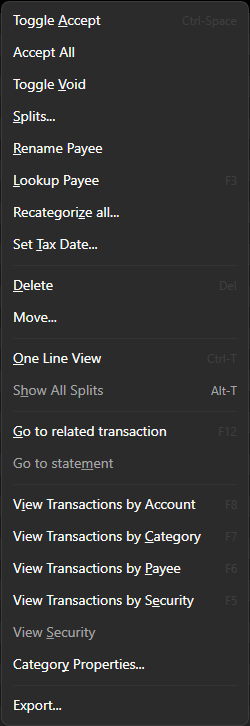

# Transactions Menu

[Bank Accounts](BankAccounts.md), [Credit Card Accounts](CreditCardAccounts.md) and
[Investment Accounts](InvestmentAccounts.md) have the following context menu for
handy commands regarding the management of your transactions.

### Toggle Accept

This command is a way to verify that the selected transaction you've imported from your bank
is something you recognize and accept.  See [Unaccepted Report](../Reports/UnacceptedReport.md).

### Accept All

Mark all transactions in the current view as "accepted".

## Toggle Void

Mark the selected transaction as `void` this means it no longer participates in the account balance
or reconciliation.  This is handy when tracking a bad check.

## Splits...

Add splits to the selected transaction.
See [Splits](../Basics/Splits.md).

## Rename Payee

Rename the payee and optionally setup an automatic rename using [Aliasing](../Basics/Aliases.md).

## Lookup Payee

Open your web browser to search for information about this payee.

## Recategorize all...

This is a convenience tool for recategorizing all transactions in the current view.
Please use with caution!

## Set Tax Date...

Sometimes a transaction in one year is actually related to the previous year's tax report.
This impacts what transactions are included in the [../Reports/TaxReport.md].

## Delete

Delete the selected transaction.

## Move...

Move the selected transaction to a different account, including any [Attachments](../Basics/Attachments.md).

## One Line View

Toggle the view between one and three lines per transaction.

## Show All Splits

Toggle the view from hiding all to showing all splits.  When hiding splits they are only visible when you press the splits
downarrow or select the `Splits...` command.

## Go to related transaction

Some transactions like [../Basics/Transfers.md] have a related transaction in another account.
This command navigates to the related transaction for the selected transaction if there is one.

## Go to statement

During the [Account Balancing](BalancingAccounts.md] process you can associate a bank statement (usually a pdf) with 
the transactions included in that statement.  This command finds that statement if there is one and opens it.

## View Transaction by Acount

Shows all transactions in the account for the selected transaction.

## View Transaction by Category

Shows all transactions that have the same category as the selected transaction.

## View Transaction by Payee 

Shows all transactions that have the same payee as the selected transaction.

## View Transaction by Security

Shows all transactions that have the same security as the selected [investment transaction](InvestmentAccounts.md).

## View Security

Navigates to the security view for and finds the security matching the selected [investment transaction](InvestmentAccounts.md).

## Category Properties

This is a short cut to the category property dialog for the category defined on the selected transaction.

## Export...

Exports all the transactions in the current view to a .csv or .xml file.  You will get the following columns:

| type          | Columns     |  |  |  |  |  |  |  |  |
| ------------- |-------------|--|--|--|--|--|--|--|--|
| investments    | Date  | Payee | Category | Activity | Symbol | Units | UnitPrice | Amount | Memo |
| other          | Account | Date | Payee | Amount | Category | Memo |

