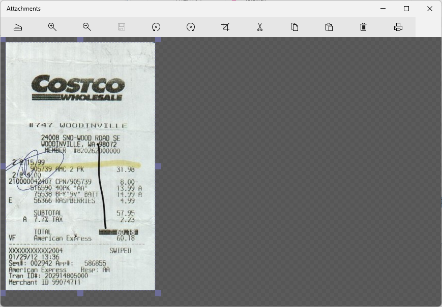
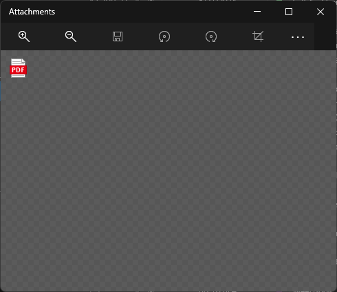

# Attachments

The first column of a transaction view is labeled "A" and stands for "Attachments".
An attachment is a file of any type that you want to associate with your transaction.

You can drag/drop any file from your desktop onto a transaction and make an Attachment that way.
You can also paste an image onto the selected transaction and it will add the image to the attachments.

When you have an attachment associated with a transaction a little paper clip appears.  When you click on this paper clip a dialog appears.

Attachments are not stored in the SQL Database, they are stored in the folder next to your database named *.Attachments.  Inside this folder you will see subfolders organized by account, and inside those you will see your attachments named with the transaction id.

If you already have an attachment then the dialog loads it up so you can see it:

If the attachment is a non-image format like .pdf you will instead see a file icon:

You can double click the icon to open the attachment.  You can also delete the selected attachment, or drag drop more files 
or paste more images.  One transaction can have as many attachments as you like.

If you are keeping receipts for sales tax deduction, check with your accountant to see if you also need to keep the paper copy someplace.

You can paste an image or any rich text (which is handy if the receipt was in an email) or any file on disk (like a .pdf file) or you can click the **Scan**  button :

A little USB connected scanner like this is perfect for scanning receipts:

Click scan and it should recognize the boundary of the image.  If the boundary is not correct, you can move the blue image cropping boundary to wherever you want and the image will be cropped when you click **save**  or close the dialog.

If you don't like the scan, just press **delete** and try again.  Some receipts have ten feet of crap at the bottom that has nothing to do with your purchase.  You might want to cut that off before scanning in order to save on disk space.   One year worth of receipts, about 750 of them, takes about 60 megabytes.   So not a big problem, you can easily store every receipt for a life time in a few gigabytes.   Most scanners have a limit to the length they can scan, if you reach that limit, just scan the second half into a new attachment.  You can have as many attachments as you want associated with a single transaction.

When you paste rich text content, it can also contain images.

**Printing**
Sometimes you need to return an item and you need a print out of the receipt, just select the image and click the print button, this only works for selected images or rich text.  For other file types you will need to use the 
appropriate file viewer to print them.

