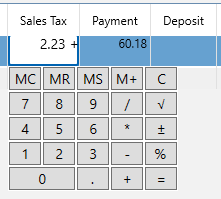

# Calculator

On most numeric fields within the MyMoney application you can type in a mathematic expression and as soon as it sees you do that a calculator will popup automatically.  For example, in the following field I have entered the expression (1500 * 9.5)/12. 

Now when I type ENTER or EQUALS it replaces the expression with the answer, in this case: $1187.50.

It will then forget the expression so no, it is not a Spreadsheet application :-)

Valid symbols are:

### ()
Parenthesis to group a sub-expression

### /
Division

### +
Addition

### -
Subtraction

### .
Decimal point

### =
Equals causes the calculation to complete.

### %
Percent (just divide by 100)

### 0-9
Decimal Digits

### ESCAPE
Cancel and close the calculator

The calculator also has some other convenient functions:
### MC
Clear the memory

### MR
Recall the memory

### MS
Set the memory

### M+
Add the value to the memory

### C
Clear the value and the memory

### √
Square root

