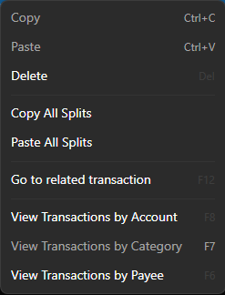

# Clipboard

You can `Copy` the selected transaction, go to another account and Paste that transaction into the other account.  It will not copy Reconciled status.  This does not create a "Transfer", this is purely a copy.  This is handy if you put the transaction in the wrong account to begin with since you can just use Cut and Paste to move it.

You can also "Copy" a single split and paste it into another transaction to add that split to the other transaction.

Lastly, you can "Copy All Splits" if you select the following command after right click on a split:

