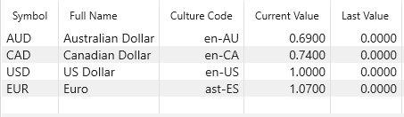

# Currencies

Notice when you [Setup an Account](../Accounts/SetupAccounts.md) you can specify a 3 letter
Currency code. You can provide details about this currency, including the current exchange rate, using
the `View/Currencies` view.

The Culture Code specified in column 3 is used to format the numbers with the right currency symbol.

These exchange rates then allow MyMoney to normalize all the dollar amounts on the
[Reports](../Reports/index.md) to the default currency.  The default currency is 'USD', but you can
specify a different default using the `View/Options` panel:

Here we've selected Euro, and now the reports will show totals in Euros:

