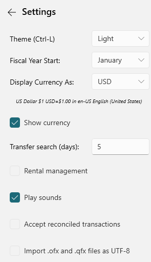

# Options

Under the View menu there is an Options… item that will bring up the following options panel:

You can use this to:

* change your database password,
* select a new UI Theme (Light or Dark)
* change when the fiscal year starts,
* Enable/Disable the Rental Management feature
* Enable/Disable playing of any sounds.

See also [Keyboard](Keyboard.md)

