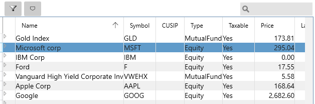

# Securities

You can view a list of your stocks, mutual funds and so on using the "Securities" View menu item.  The following view appears, and is where you can specify the **Type**  of the security.    The current price for Securities is automatically retrieved if you configure your [Stock Quote Service](../Accounts/StockQuoteServices.md).  The "LastPrice" is the previous day's closing price and %Change is the daily change since the last download.

The Type column can have these values:

The **Private**  type allows you to track other kinds of non-publicly traded investments.  If the [Stock Quote Service](../Accounts/StockQuoteServices.md) doesn't know what it is then you can enter the price details manually. 

The little triangle arrow on the left side expands to show this view where you can enter stock split information.  Click the triangle again to hide the stock splits.

You only need to go back as far as your first Buy transaction for each security.  The following web site can be a good source of stock split history information: [https://www.stocksplithistory.com](https://www.stocksplithistory.com)

You can use the filter button at the top of the view to list only securities that are currently held rather than all the securities you have owned in the past.

Lastly the CUSIP column may be important for automatically finding the right security when you download your statements.  For this to work you need to look up the CUSIP number for your security (you can sometimes find it the memo field or the Payee field - for a new security we haven't seen before).  You can then add the new security with that CUSPID and correct Name and Symbol, then future downloads will match that correctly.
