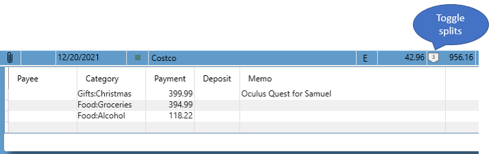

# Splits

You can specify multiple Payees, or Categories for a transaction by "splitting" it using this context menu item when you right click on a transaction:

Then a little widget will appear next to the payment column so you can expand/collapse the split details.

You can enter multiple split entries with different payee/category information, and it will calculate the difference between your split entries and the transaction amount and show any "Unassigned amount".   The unassigned amount is computed and displayed at the bottom of the split list like this (notice the split button also has a red outline which is a visual clue that there is an unassigned amount on this transaction):

It is good to ensure there is no unassigned amount when you are done.    You can also press F6 when focused on a Payment field of a split and it will calculate the amount of the selected split such that there is no unassigned amount remaining.

You can use the [Cash Flow Report](../Reports/CashFlowReport.md) to find all transactions that have "Unassigned amounts".

You can also use this button on the toolbar to show or hide all splits for all transactions in the current view:

You can do a transfer in a split, see [Transfers](Transfers.md) for details.

If you right click a split the context menu provides the following handy things:

### Copy
Copy the split onto the clipboard.

### Paste
Paste the split into another transaction

### Delete
Delete the split

### Copy all splits
Copy all splits onto the clipboard.

### Paste All Splits
Paste all those splits elsewhere.

### Go to related transaction
Jump to the other side of a transfer split.

### View Transactions by Account
View all transactions in the same account as the selected split

### View Transactions by Category
View all transactions that have the same category as the selected split
### View Transactions by Payee
View all transactions that have the same payee as the selected split

