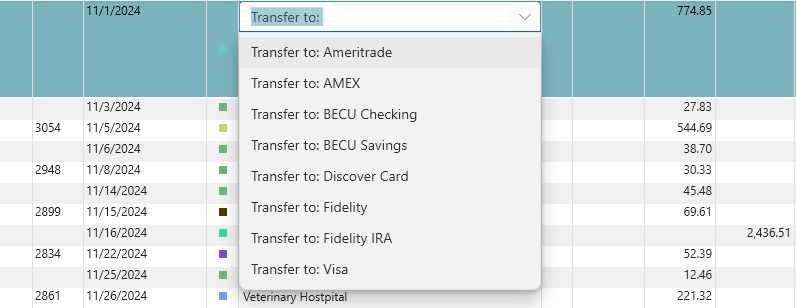

# Transfers

You can create a "Transfer" transaction any time by entering "Transfer to: xxx" or "Transfer from: yyy" where "xxx" and "yyy" are your account names.  These Payees are automatically added to your Payee drop down.  As soon as you type "Transfer" you will see something like this:

Pick the account you are transferring money to and enter the amount.  A matching transaction will be created automatically in the other account.  These two transactions are separate, but linked by the transfer.  If you delete one side of the transfer, the other side is also deleted, unless the other side is reconciled, in which case it will not let you delete either side.  You can only change a reconciled transaction during balancing, so if you really need to change a reconciled transfer, you will need to go into balance mode, add another transaction of the same amount, mark that as reconciled, then remove the reconciled state from the transfer.  Now you can delete the transfer.  This may seem painful, but believe me, this stops a **lot**  of bugs creeping into your balancing process.  In fact, after 15 years of using this software, I've never had one case where I try and balance an account and the "Previous Balance" doesn't match my bank statement.   See [Balancing Accounts](../Accounts/BalancingAccounts.md) for details.

You can use F12 to navigate back and forth between the two sides of the transfer.

You can also use F12 to create a transfer, if you are located on a transaction that is not yet a transfer, but should be and there is a matching transfer in another account it will prompt you to create
the transfer for the matching transaction.

You can also do transfers from a Split, in fact, this is usually the only time you would use the Payee column in a Split:

This is handy if you deposit a bunch of checks as one deposit.

What you cannot do is have a split transfer go to a split on the other side of that transfer.  But I have never found the need for that sort of thing.

