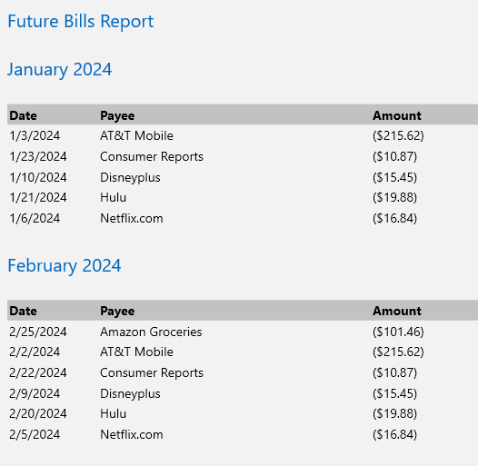

# Future Bills Report

This report tries to find recurring payments form transactions with a Category type `Expense` and
a Frequency not equal to `None` so it can forecast
what your upcoming payments might be over the next 12 months.

You might see something like this:

It will repeat this out for 12 months and then show the total for
the year.

You can force a category top show up in this report by changing
the frequeny to something other than `None`.
See [Categories Dialog](../Basics/Categories.md)