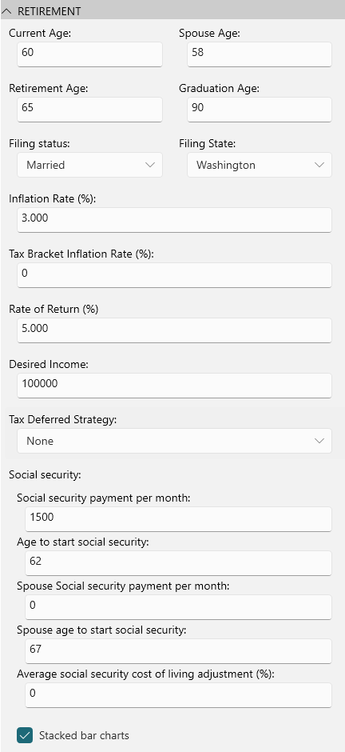
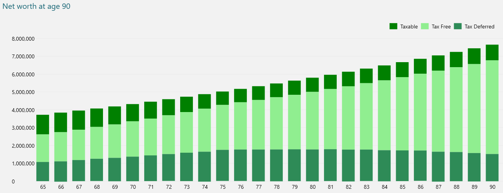
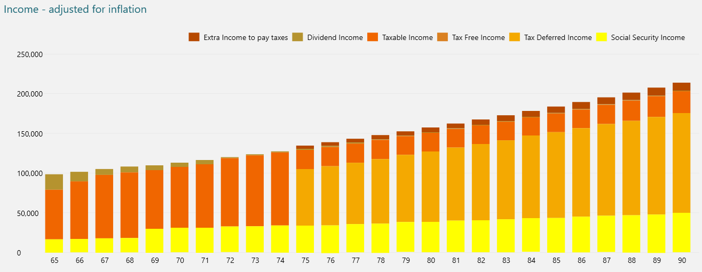
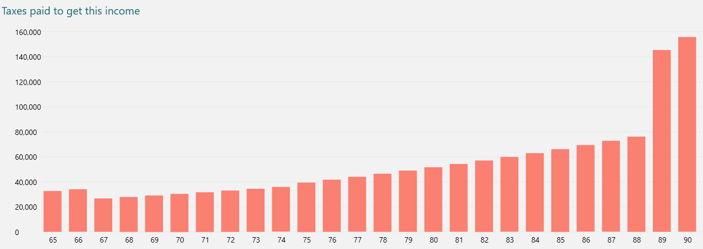
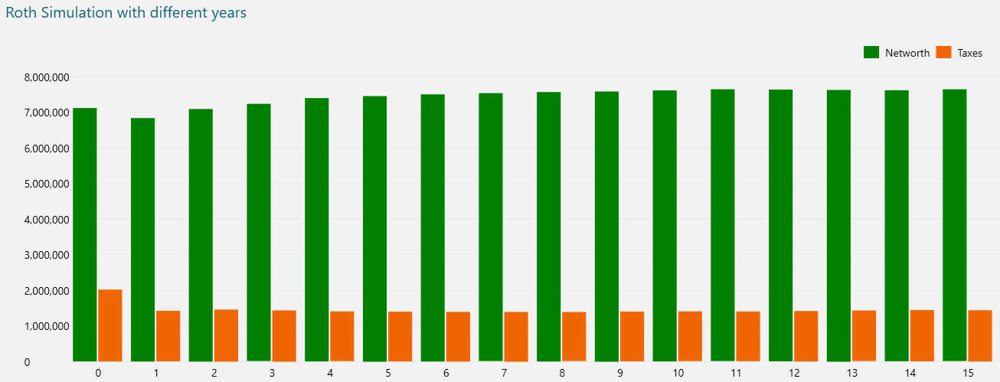
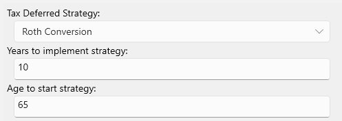

# Retirement Plan Report

If you have a brokerage account containing taxable assets, perhaps also some tax deferred accounts like 401k or
traditional IRA, and some tax free accounts like a Roth IRA, this report can plot out what your retirement income might
look like, how your retirement funds could be used, and gives you a way to explore some other scenarios, like what
effect it has if you change your retirement income, do a Roth conversion on any tax deferred accounts, move to a
different state, or change your social security income age.

To setup the report you need to enter some values in the RETIREMENT details as follows:

Assuming you started with the following portfolio:

- $1.25 million in a taxable brokerage account (with some cost basis)
- $1.2 million in a 401k tax deferred account
- $1 million in a Roth IRA tax free account.

Assuming you also want a $100,000 retirement income each year and assuming some reasonable inflation rates and return on
investments, the first part of the report shows a summary of assets remaining at the end date (in this case age 90):

| Category                           |     Amount |
| ---------------------------------- | ---------: |
| Assets remaining at age 90         | $7,526,603 |
| - Taxable assets                   |   $877,394 |
| - Tax deferred assets              | $1,409,389 |
| - Tax free assets                  | $5,239,820 |
| Total taxes paid during retirement |   $211,048 |

And then it shows some charts, the first one is a chart showing how each class of asset grows and/or is drawn down over
the years as follows:

You can see here the retirement planner prefers not to use tax free assets, as this asset gives you more control and makes estate planning easier on beneficiaries.

The next chart shows where your retirement income is coming from, with different color bars for different types of
income. The darker brown bar is the additional income you need to take in order to pay the necessary taxes.
The report can estimate dividend income too if you have enough dividend transactions in your database from which
it can compute a projected dividend yield.

This shows that you start off tapping into taxable assets until age 75 when required minimum distribution kicks in on
your tax deferred accounts. In this case we have elected to take early Social security at age 62 since that is what we
configured in the settings. It is often interesting to play with your social security age, waiting till 70 is not always
the best strategy.  You may find that starting at 62 results in higher networth. Even though the social security amount
is usually a lot lower at 62, that income means you have to sell fewer assets to make up your desired income and usually
those assets are growing faster than the social security income does.  The Cost of Living adjustment on Social Security
income can be low, right now it is about 2.5%. You should try the numbers for 62, 67 and 70 and see which one wins.

The next chart shows how much tax you had to pay each year, this report computes tax recursively since you will sometimes
need to pay tax by selling assets, you then have to pay tax on those assets sold, and repeat, this report computes all
that for you which is shown as the "extra income to pay taxes" shown in the previous chart:

Here you see a jump in taxes when any Tax Deferred account required minimum distributions (RMD's) kick in or when you
enter a new tax bracket. Retirement planning is often about managing your tax brackets and converting deferred tax
accounts to Roth to avoid this "RMD tax bomb".

The final chart runs a Roth conversion simulation passing in different years to implement the roth conversion from 0 (no conversion which we have above) out to 15 years, plotting the networth at age 90 and the total tax paid over each simulation. as follows:

This can help you figure out the optimal roth conversion strategy to maximize assets and minimize taxes.  Roth
conversion can limit the RMD tax bomb, but in this case a Roth conversion did not help, so this shows a Roth conversion
does not always win, unless your goal is to maximize your tax free account.

To experiment with Roth Conversion on your portfolio you can then plug these numbers into the settings panel here:

And see the details as the report updates.

Roth strategy is complicated and you will not always see the same result. It depends on your situation.  A Roth conversion
can help by reducing any additional taxes incurred by RMD's. The Roth conversion is also great for
estate planning as tax free accounts pass on a less complicated tax burden to your beneficiaries.

But before settling on a Roth strategy you should also experiment with different returns on investment rates.  You will
notice that if the market returns are very low or negative, then Roth conversion usually does not make sense, while high
market ROI usually means a Roth conversion is a good idea.

Note that all of this is just an `estimate` based on the inflation rate and rate of return predictions you provided and
it it uses an estimated capital gains based on your current holdings, which assumes you hold the same stuff, which is
unlikely for this extended period. This simulation also assumes today's (2026) tax rates, and does not modify the tax
rates over the years which we know never happens. It does apply inflation adjustments to the tax brackets, which the IRS
normally does also, but chances are tax rates themselves will also go up from where they are now.  All this to say this
is only a simulation, but it can be a useful way to shows you how the variables interact in your case. You should also
consult a retirement planning specialist before making any big financial decisions.
