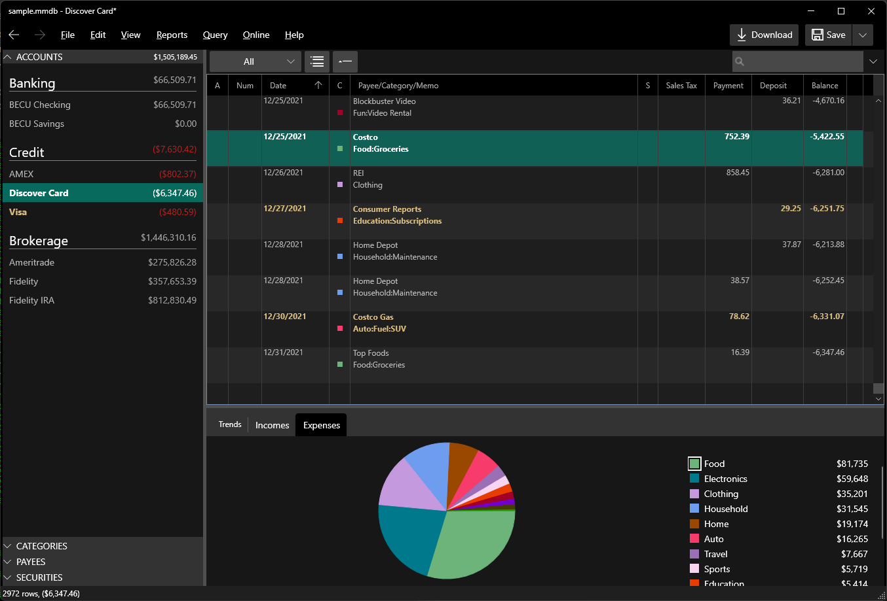

# Home

**MyMoney**  is a rich client [.NET 4.8 ClickOnce application](https://dotnet.microsoft.com/en-us/download/dotnet-framework/net48) for managing your personal finances.  See [Demo Video](https://youtu.be/u6BVF2x9FBA).

<a href="Basics/install" class="btn btn-primary mt-20 mr-30" style="color:#EEEEFF" >Install</a>
 
 

The app comes with beautiful modern Light and Dark themes that are accentuated with your chosen Windows Accent color:

The app provides many handy features:

Supports [Banking](Accounts/BankAccounts.md), [Credit Card](Accounts/CreditCardAccounts.md), [Investment](Accounts/InvestmentAccounts.md) and [Assets](Accounts/Assets.md) accounts, with [Auto Categorization](Basics/AutoCategorization.md), and auto identification and [merging](Basics/Merging.md) of duplicate transactions. 

Save a lot of typing using [Online Banking](Accounts/OnlineBanking.md) to download statements from your bank, using OFX over [secure](Accounts/OnlineSecurity.md) HTTPS. No middle man storage of your account information, MyMoney talks directory from your PC to your bank, which is just as secure as if you logged onto your Bank website and downloaded transactions yourself. For banks that don't support OFX, you can download Money or Quicken QFX files and import them.

Secure storage of your data in a password protected SQL Lite database.  See [Setup](Basics/Setup.md) for details.

Instant  [Charts](Charts/index.md) and [Reports](Reports/index.md) show everything from current spending trends in your accounts, to pie charts showing spending by category, to bar charts showing historical spending by year or month, to portfolio charts showing your current holdings across stocks, mutual funds, and other investment categories.

Tax Categories can be assigned so that you can export your tax information to Turbo Tax. This includes a capital gains tax report for investments organized into short term and long term.   See [Tax Report](Reports/TaxReport.md).

Bug free account reconciliation ([balancing](Accounts/BalancingAccounts.md)) process that guarantees that once a statement is reconciled it stays that way. MyMoney stops you from making silly mistakes that could destroy years of account balancing.

[Quick Search](Basics/QuickSearch.md) gives you a powerful ability to find anything in many years of historical data almost instantly. For example, type "(costco or arco) and fuel" to find all transactions recording a fuel related purchase from either costco or arco. You can also do more [Advanced Queries](Basics/Queries.md) to find a specific set of transactions.

[Attachments](Basics/Attachments.md) can be associated with each transaction which is handy for tracking additional information that doesn't fit in the memo field. You can also use this to store a scanned copy of your store receipts so you can find your receipts quickly and easily.  You can also attached bank statement .pdf files during account balancing so you can easily open the statement
for a given reconciled transaction.

Every numeric field in the application pops up a [calculator](Basics/Calculator.md) so you can enter expressions to compute the value you want in that field. This saves you from having to switch between applications and makes entering data much more efficient.

[Extensibility](dev/index.md) in the architecture so developers can easily add their own favorite features. For example, one developer added support for managing rental properties and loans while another added support for easily tracking sales tax.

Multiple currencies. When you setup an account you can specify the currency used by that account. This is handy if you have overseas accounts. It is then able to handle the fact that transfers between accounts with different currencies will not necessarily have the same amount on either side of those transfers.

Lastly, for additional eye candy, the application supports
beautiful [Modern WPF](https://github.com/Kinnara/ModernWpf) light and a dark themes. See [Options](Basics/Options.md).
